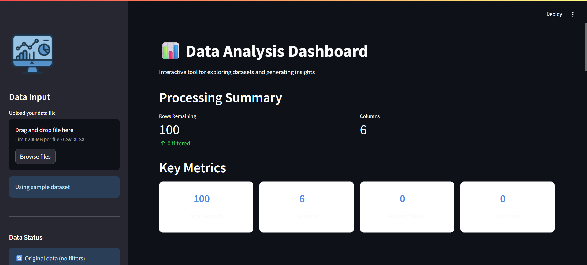
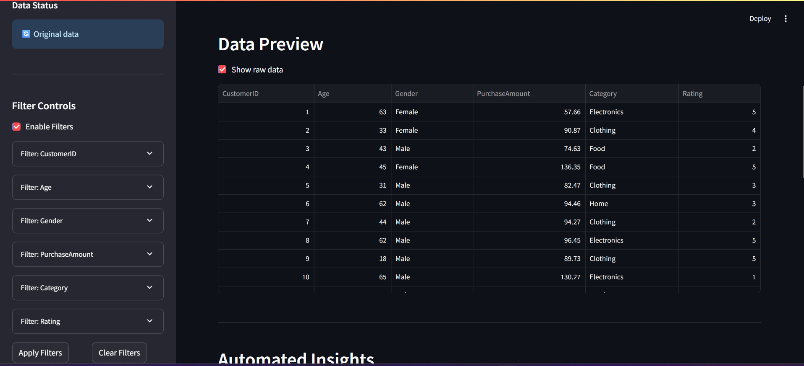
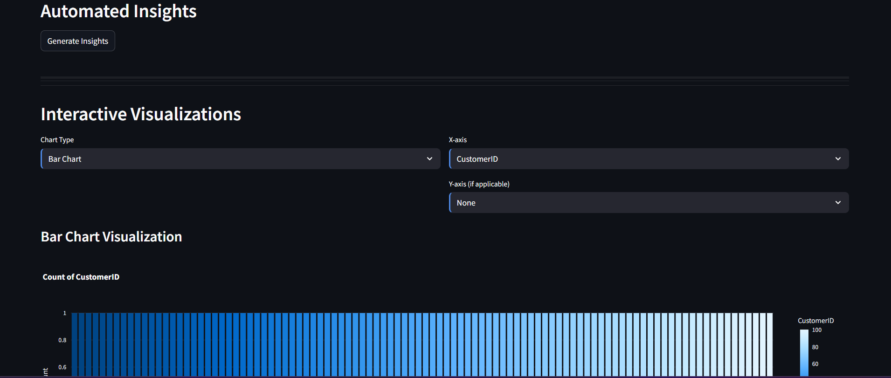
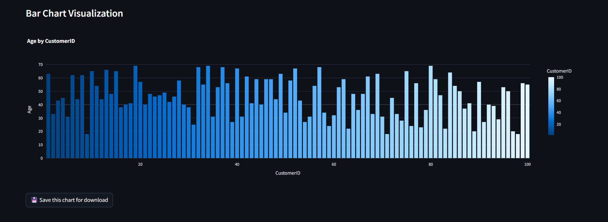
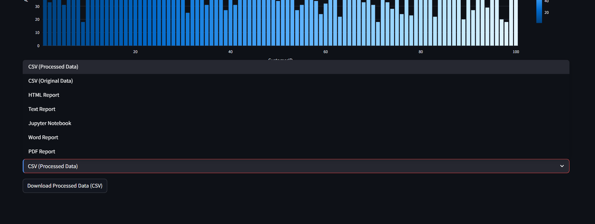

# 📊 Data Analysis Dashboard Generator


A Streamlit-powered dashboard for automated data exploration, visualization, and report generation.







## ✨ Features

- **Data Import**:
  - CSV/Excel file upload
  - Built-in sample dataset
  - Automatic type detection

- **Interactive Analysis**:
  - Dynamic filtering controls
  - Automated statistical insights
  - Missing value detection

- **Visualizations**:
  - Multiple chart types (Bar, Histogram, Scatter, Pie, Box)
  - Chart customization
  - Save visualizations for reports

- **Export Options**:
  - PDF/Word professional reports
  - HTML interactive reports
  - Jupyter Notebooks with generated code
  - Processed data in CSV format

## 🚀 Quick Start

### Prerequisites
- Python 3.8+
- pip package manager

### Installation
```bash
# Clone repository
git clone https://github.com/Ayan2806/Data-analysis-and-dashboard-generator.git
cd Data-analysis-and-dashboard-generator

# Install dependencies
pip install -r requirements.txt

# Launch application
streamlit run app.py